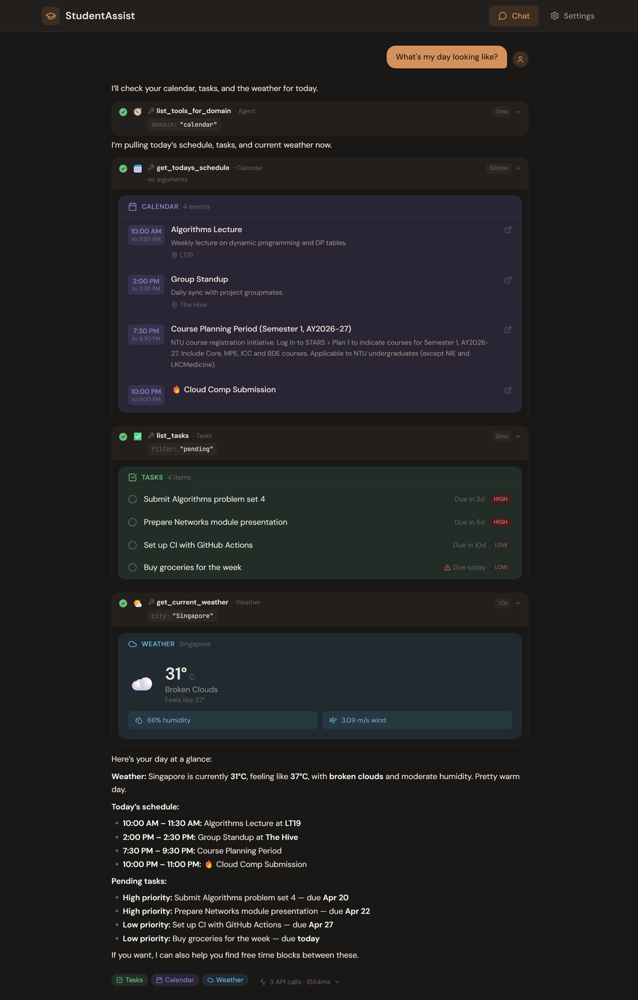
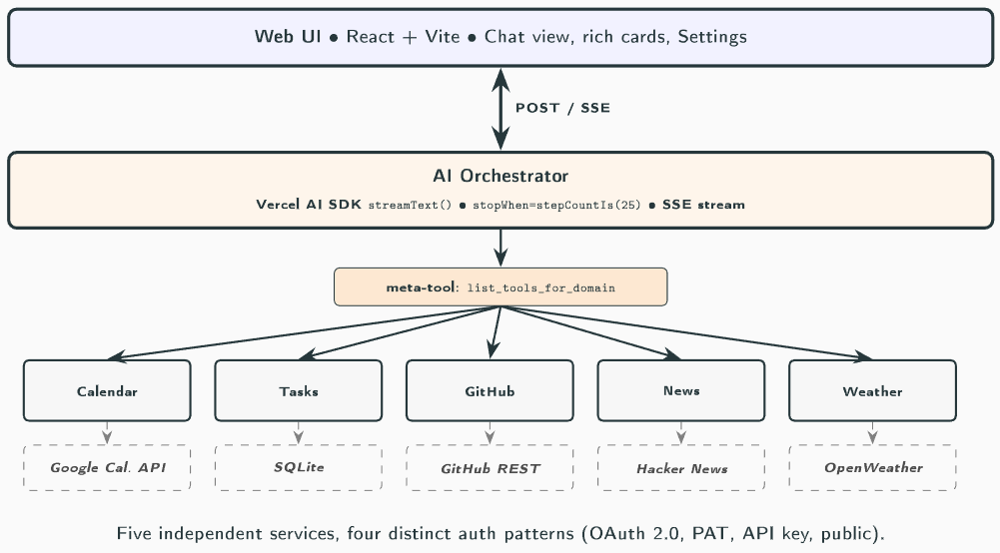

# StudentAssist

> A conversational Personal Assistant-as-a-Service for university students. One chat interface coordinates five RESTful microservices (Calendar, Tasks, GitHub, News, Weather) through an LLM orchestrator with 17 typed AI tools and dynamic tool discovery.

<p align="center">
  
  <br>
  <sub><i>Place a screenshot at <code>docs/hero.png</code>. Suggested shot: the chat view on a common prompt such as &ldquo;what does my day look like?&rdquo;.</i></sub>
</p>

Built for **SC4052 Cloud Computing** at the College of Computing and Data Science (CCDS), NTU. The project is a response to Topic 2 (Personal Assistant-as-a-Service) and is designed as a security-conscious alternative to the OpenClaw family of agents.

---

## Highlights

- **Five independent microservices.** Calendar (Google), Tasks (local SQLite), GitHub, News (Hacker News), Weather (OpenWeatherMap). Four distinct auth patterns: OAuth 2.0 Authorization Code, Personal Access Token, API key, public.
- **17 typed AI tools.** Every tool is a Zod-schema contract consumed by the [Vercel AI SDK](https://sdk.vercel.ai/). No raw shell, no raw filesystem.
- **Dynamic tool discovery.** The system prompt lists domain *names* only. The model fetches tool specs on demand through a meta-tool, `list_tools_for_domain`. RAG over the tool catalogue.
- **Bounded reasoning.** `streamText()` with `stopWhen=stepCountIs(25)` and per-turn `activeTools` filtering.
- **Rich UI.** Streaming chat over SSE, live reminder countdowns, data cards (calendar, tasks, news, weather, commits), per-turn tool traces.
- **One command to run.** `docker compose up` ships the whole thing.
- **Mock mode.** No API keys? Set `MOCK_MODE=true` to get realistic demo data for every service.

## Architecture

<p align="center">
  
  <br>
  <sub><i>Place the architecture diagram at <code>docs/architecture.png</code>.</i></sub>
</p>

The UI streams from the orchestrator over Server-Sent Events. Before invoking any service the orchestrator consults the meta-tool `list_tools_for_domain`, which returns the Zod specifications for just the tools in that domain. Each service fronts its own external API or local database with its own authentication method.

## Tech stack

| Layer      | Stack                                                                 |
|------------|-----------------------------------------------------------------------|
| Runtime    | [Bun 1.3](https://bun.sh/) (single workspace, `packages/*`)           |
| Server     | [Hono](https://hono.dev/) · TypeScript · [Drizzle ORM](https://orm.drizzle.team/) + SQLite |
| AI         | [Vercel AI SDK](https://sdk.vercel.ai/) · OpenAI `gpt-4o-mini` (default) · [Zod 4](https://zod.dev/) |
| Client     | React 19 · Vite 6 · TailwindCSS 4 · React Router 7                    |
| Packaging  | Multi-stage Dockerfile · `docker-compose.yml` with a named volume      |
| External   | Google Calendar API · GitHub REST · Hacker News · OpenWeatherMap       |

## Quick start with Docker

```bash
git clone https://github.com/faqihxdev/sc4052-student-assist.git
cd sc4052-student-assist

cp .env.example .env
# edit .env with your keys (see below). Or set MOCK_MODE=true to skip all keys.

docker compose up --build
```

Open `http://localhost:3000`.

## Local development (without Docker)

Prerequisites: [Bun 1.3+](https://bun.sh/).

```bash
bun install
cp .env.example .env   # fill in keys or set MOCK_MODE=true
bun run db:push        # create the SQLite schema
bun run dev            # runs server (3000) + client (5173) concurrently
```

Visit `http://localhost:5173`. The Vite dev server proxies `/api/*` to the Bun server on port 3000.

### Useful scripts

| Command                  | What it does                                              |
|--------------------------|-----------------------------------------------------------|
| `bun run dev`            | Run server and client in parallel watch mode              |
| `bun run dev:server`     | Server only                                               |
| `bun run dev:client`     | Client only                                               |
| `bun run build`          | Build the React bundle into `packages/client/dist`        |
| `bun run start`          | Run the server with no watcher                            |
| `bun run db:generate`    | Generate Drizzle SQL migrations from schema changes       |
| `bun run db:migrate`     | Apply pending migrations                                  |
| `bun run db:push`        | Push the schema directly (dev convenience)                |

## Environment variables

Copy `.env.example` to `.env`. All keys are read by the server; no secrets reach the browser.

| Variable                 | Purpose                                                   |
|--------------------------|-----------------------------------------------------------|
| `OPENAI_API_KEY`         | OpenAI API key used by the orchestrator                   |
| `OPENAI_MODEL`           | Model id. Default: `gpt-4o-mini`                          |
| `GOOGLE_CLIENT_ID`       | OAuth client id for Google Calendar                       |
| `GOOGLE_CLIENT_SECRET`   | OAuth client secret                                       |
| `GOOGLE_REDIRECT_URI`    | Must match the URI registered in Google Cloud Console     |
| `GITHUB_TOKEN`           | Personal Access Token with `read:user`, `repo` scopes     |
| `OPENWEATHERMAP_API_KEY` | OpenWeatherMap API key                                    |
| `PORT`                   | Server port. Default: `3000`                              |
| `DB_PATH`                | SQLite path. Default: `./data/student-assist.db`          |
| `MOCK_MODE`              | `true` returns demo fixtures for all services             |

### Getting the external credentials

- **OpenAI.** `https://platform.openai.com/api-keys`.
- **Google Calendar.** Create an OAuth 2.0 client in [Google Cloud Console](https://console.cloud.google.com/). Authorized redirect URI: `http://localhost:3000/api/v1/auth/google/callback`. Required scope: `https://www.googleapis.com/auth/calendar`.
- **GitHub.** [Create a PAT](https://github.com/settings/tokens) with `read:user` and `repo` scopes.
- **OpenWeatherMap.** Free tier key from `https://openweathermap.org/api`.

## Demo mode

The project ships with a dedicated demo page (logo in the Settings page header) that seeds reproducible fixtures for three demonstrations:

1. **Parallel fan-out.** One prompt, three concurrent tool calls.
2. **Retrieve, reason, write.** Read a news article, reason about it, conditionally schedule follow-up.
3. **Conversational reschedule.** Three prompts, stateful conversation, anti-hallucination refetch.

Demo state is isolated per user via `extendedProperties.private.studentassist_demo` on Google Calendar events, so resetting the demo does not touch personal events.

## Project structure

```
codebase/
├── Dockerfile                  # multi-stage build
├── docker-compose.yml          # one-command run with named volume
├── .env.example                # required + optional env vars
├── package.json                # workspace root
└── packages/
    ├── shared/                 # shared TypeScript types between server and client
    ├── server/                 # Hono server, AI orchestrator, service modules
    │   └── src/
    │       ├── services/       # calendar, tasks, github, news, weather, settings, demo
    │       ├── routes/         # HTTP + SSE route handlers
    │       ├── ai/             # orchestrator, tool definitions (Zod), system prompt
    │       ├── db/             # Drizzle schema + seed fixtures
    │       └── lib/            # OAuth, mock data, utilities
    └── client/                 # React + Vite app
        └── src/
            ├── pages/          # Chat, Settings, Demo
            ├── components/     # chat segments, data cards, layout
            └── lib/            # streaming client, typed API helpers
```

## Security posture

Designed as a deliberate contrast to the OpenClaw failure modes identified in Gartner's 2026 advisory:

| Concern         | StudentAssist                                              |
|-----------------|------------------------------------------------------------|
| Credentials     | Server-side SQLite; never sent to the browser              |
| OAuth           | Full Authorization Code flow, server-side token exchange   |
| Key exposure    | API keys excluded from every response body                 |
| Access scope    | 17 typed tools; no raw shell, no raw filesystem            |
| Guardrails      | Server-owned system prompt, enforced by typed contracts    |
| Network         | Not internet-exposed by default; runs on localhost         |

## Acknowledgements

Muhammad Faqih Akmal (U2322254L), CCDS, NTU. SC4052 Cloud Computing, April 2026.

The architecture and terminology follow patterns popularised by the Vercel AI SDK, the Model Context Protocol, and the retrieval-augmented tool-selection literature.
